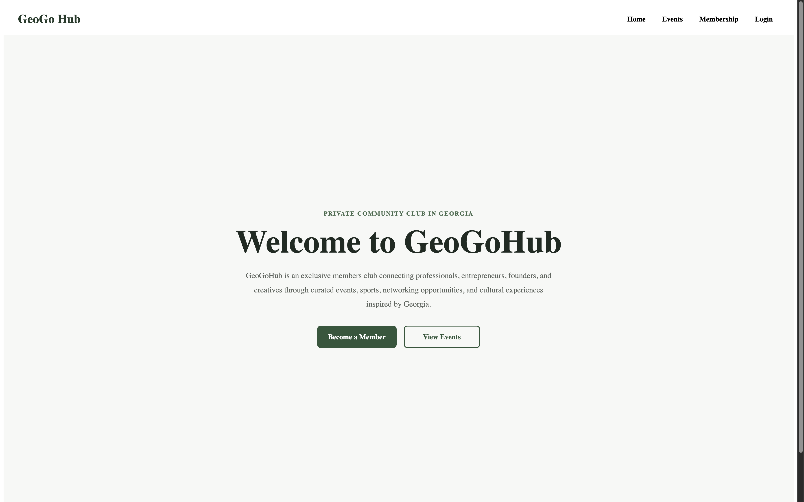
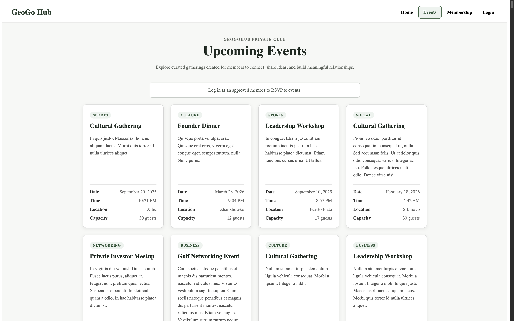
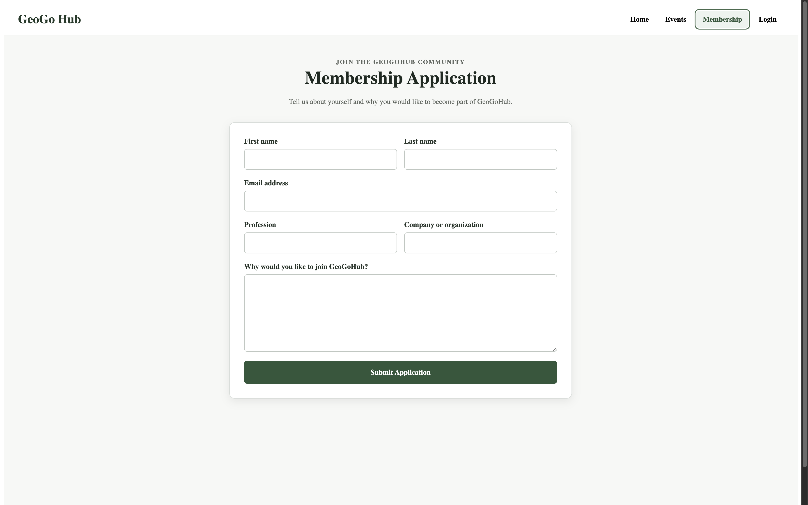
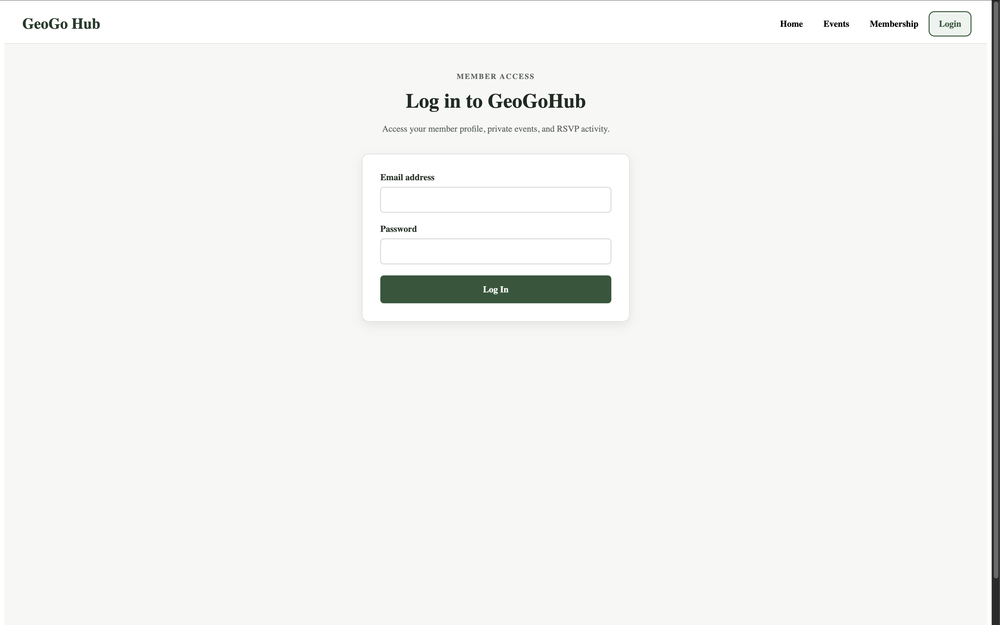
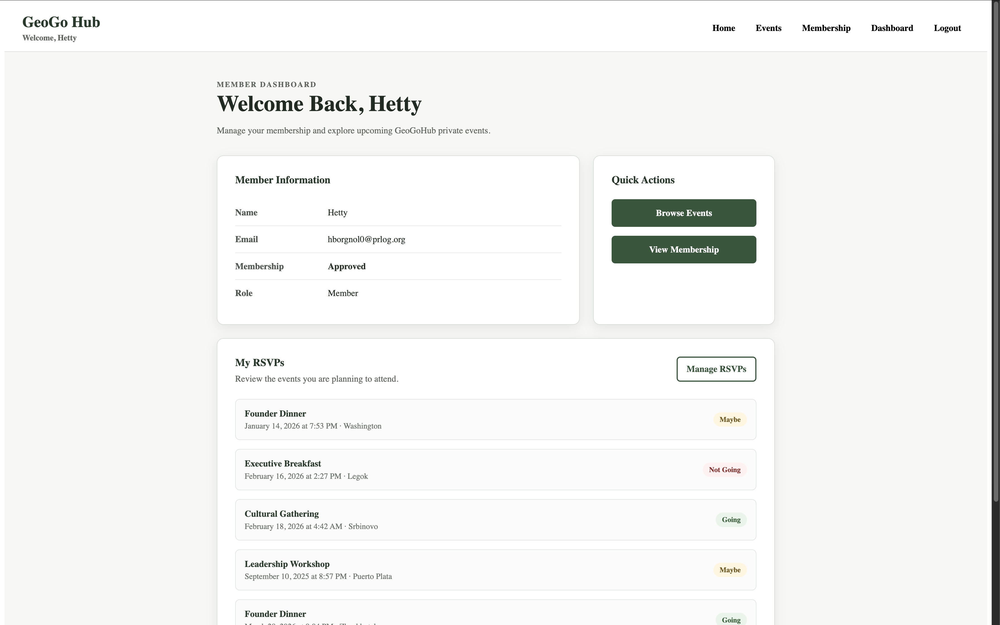
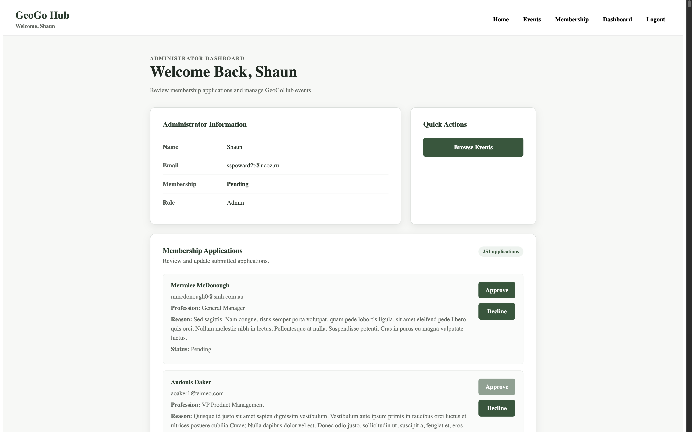

# GeoGoHub

## Table of Contents

- [Project Description](#project-description)
- [Project Objective](#project-objective)
- [Live Application](#live-application)
- [Application Screenshots](#application-screenshots)
- [Application Wireframe](#application-wireframe)
- [Technologies Used](#technologies-used)
- [Important Deployment Note](#important-deployment-note)
- [Main Features](#main-features)
- [Database Structure](#database-structure)
- [CRUD Functionality](#crud-functionality)
- [Large Dataset Requirement](#large-dataset-requirement)
- [Build Instructions](#build-instructions)
- [Testing Accounts](#testing-accounts)
- [Tools Used for Testing](#tools-used-for-testing)
- [Challenges Encountered](#challenges-encountered)
- [Known Limitations](#known-limitations)
- [Future Improvements](#future-improvements)
- [Project Highlights](#project-highlights)
- [Developed By](#developed-by)
- [Contact](#contact)
- [License](#license)

---

## Project Description

GeoGoHub is a full-stack web application for a curated private members club in the Republic of Georgia.

The platform is designed for established professionals, entrepreneurs, founders, investors, creatives, executives, and community leaders who want to build meaningful personal and professional relationships through exclusive social, cultural, and networking events.

The inspiration for GeoGoHub comes from my birth country, the Republic of Georgia. Georgia has a growing professional, entrepreneurial, and creative community, and GeoGoHub provides a centralized platform where selected members can discover and attend curated gatherings.

Unlike open event platforms, GeoGoHub uses an application-based membership system. Visitors may apply to join the club, while administrators review each application and approve or decline prospective members.

Approved members can browse private events, RSVP to gatherings, and manage their attendance through a personalized dashboard.

Examples of events featured on the platform include:

- Founder dinners
- Business roundtables
- Professional networking events
- Golf gatherings
- Cultural experiences
- Private discussions
- Card nights
- Community events

GeoGoHub combines membership management, event discovery, authentication, administration, and RSVP functionality in one full-stack application.

The final application includes the following primary pages:

- Home Page
- Events Page
- Membership Application Page
- Login Page
- Member Dashboard
- Administrator Dashboard

---

## Project Objective

GeoGoHub demonstrates a full-stack web application built with React, Node.js, Express, Passport.js, and the MongoDB Native Driver. The project showcases secure authentication, role-based authorization, CRUD operations, and an application-based membership workflow for managing exclusive professional events.

---

## Live Application

### Website

[GeoGoHub Live Application](https://geogohub.onrender.com/)

### GitHub Repository

[GeoGoHub GitHub Repository](https://github.com/ShorenaK/GeoGoHub)

### Presentation Deck

[Presentation Slides](https://docs.google.com/presentation/d/13YsUJN9wiZLQY1QgLQalpNRzwHMoEJZx5QglgEJHFKE/edit?usp=sharing)

---

## Application Screenshots

### Home Page



### Events Page



### Membership Application Page



### Login Page



### Member Dashboard



### Administrator Dashboard



---

## Application Wireframe

### Original Wireframe


### Final Wireframe


The final design implements the following application areas:

- Public Home Page
- Events Page
- Membership Application
- User Login
- Member Dashboard
- Administrator Dashboard

---

## Technologies Used

### Front-End

- React
- React Hooks
- JavaScript (ES6+)
- HTML5
- CSS3
- Vite
- PropTypes
- Fetch API

### Back-End

- Node.js
- Express.js
- Passport.js
- Passport Local Strategy
- Express Session
- MongoDB Native Driver

### Database

- MongoDB Atlas

### Development Tools

- Visual Studio Code
- Git
- GitHub
- npm
- MongoDB Compass
- Thunder Client
- Browser Developer Tools
- ESLint
- Prettier
- Mockaroo

### Deployment

- Render
- MongoDB Atlas

---

## Important Deployment Note

GeoGoHub is deployed using Render's free service tier.

The application may take approximately **30–60 seconds** to start after periods of inactivity.

If the website does not load immediately:

1. Wait for the Render service to wake up.
2. Refresh the page.
3. Allow the application a few moments to connect to MongoDB Atlas.

---

## Main Features

- Application-based membership system
- Passport.js authentication
- Secure session management
- Role-based authorization
- Professional event listings
- RSVP management
- Personalized member dashboard
- Administrator dashboard
- Membership application approval workflow

---

## Database Structure

GeoGoHub uses four MongoDB collections:

- Users
- Applications
- Events
- RSVPs

---

## CRUD Functionality

### Create

- Membership applications
- Event RSVPs

### Read

- Events
- User profiles
- Membership status
- RSVPs
- Membership applications

### Update

- Membership approval/decline
- RSVP status
- Events

### Delete

- RSVPs
- Applications
- Events

---

## Large Dataset Requirement

GeoGoHub includes more than **1,000 synthetic MongoDB records** generated with **Mockaroo** for testing and development.

The data was imported into MongoDB Atlas and used to validate database operations and administrator functionality.

---

## Build Instructions

git clone https://github.com/ShorenaK/GeoGoHub.git

cd GeoGoHub/backend
npm install

cd ../frontend
npm install

## Configure the required environment variables

### Start the backend
cd ../backend
npm start

### Start the frontend
cd ../frontend
npm run dev
---

## The following accounts provided below are for the professor and TA's to test the application.

### Testing Accounts

#### Approved Member Account

```text
Email: hborgnol0@prlog.org
Password: password123
```

This account has:

```text
Role: Member
Membership Status: Approved
```

Use this account to test:

- Member login
- Approved membership status
- Events
- RSVP functionality
- Member dashboard
- Logout

### Administrator Account

```text
Email: sscourgieu@narod.ru
Password: password123
```

This account has:

```text
Role: Admin
Membership Status: Approved
```

Use this account to test:

- Administrator login
- Administrator dashboard
- Membership application review
- Approve functionality
- Decline functionality
- Application totals

---

## Tools Used for Testing

- Thunder Client
- MongoDB Compass
- Browser Developer Tools
- ESLint
- Prettier

---

## Challenges Encountered

Some of the primary challenges encountered during development included:

- Implementing Passport.js authentication
- Connecting React to the Express backend
- Managing user roles and membership status
- Preventing duplicate applications
- Connecting RSVP records with users and events
- Generating and testing over 1,000 database records
- Deploying the application using Render and MongoDB Atlas

---

## Known Limitations

GeoGoHub currently uses the default in-memory session store provided by `express-session`.

Although the browser session cookie is configured to last for up to 30 days, server-side sessions may be lost when the Render service:

- Restarts
- Redeploys
- Spins down because of inactivity

Users may therefore need to log in again after the application restarts.

A persistent MongoDB- or Redis-backed session store is planned as a future improvement.

The administrator dashboard currently focuses primarily on reviewing and updating membership applications. Additional event-management controls may be added in a future version.

---

## Future Improvements

Planned future enhancements include:

- Persistent MongoDB- or Redis-backed session storage
- Forgot-password functionality
- Password-reset functionality
- Show-or-hide password control on the login page
- Email confirmation after membership application submission
- Estimated application review timeframe
- Email notifications when an application is approved or declined
- User registration
- Email verification
- Member profile editing
- Profile picture uploads
- Profile editing
- Advanced event search
- Event category filters
- Event location filters
- Interactive calendar integration
- Event reminder notifications
- Expanded administrator event management
- Administrator RSVP management
- Member messaging
- Improved mobile responsiveness
- Calendar integration

---

## Project Highlights

- Full-stack React, Express, and MongoDB application
- Passport.js authentication
- Role-based authorization
- Membership application workflow
- RSVP management
- Personalized dashboards
- MongoDB Native Driver (without Mongoose)
- Fetch API (without Axios)
- Deploying the complete application using Render and MongoDB Atlas
- Creating a professional interface inspired by Georgia's professional and cultural community

---

## Developed By

**Shorena K. Anzhilov**

### GitHub

[ShorenaK](https://github.com/ShorenaK)

### LinkedIn

[Shorena K. Anzhilov](https://www.linkedin.com/in/shorenaanzhilov/)

---

## Contact

Questions and feedback are welcome.

[Email Me](mailto:shorenaanzhilov@gmail.com)

---

## License

This project is licensed under the MIT License.