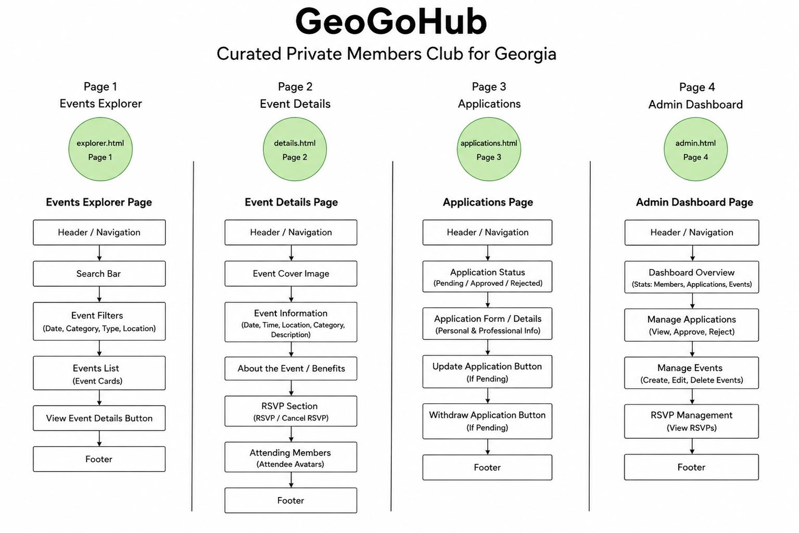
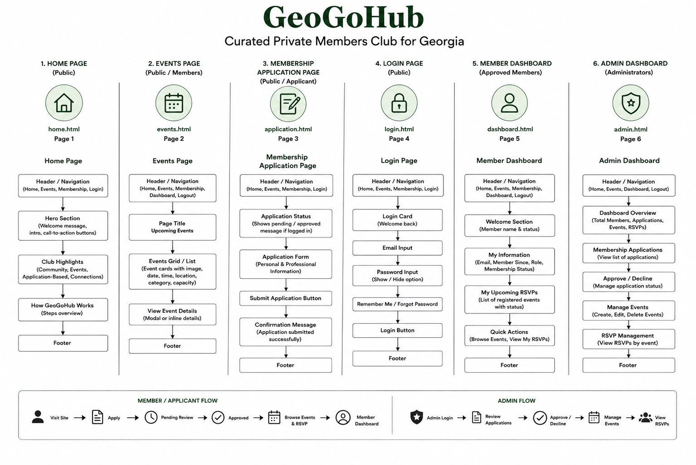

// Your Design Document is well done and organized. As I said before, I mentioned that some sections included in this document are not needed in the
// general README.md file, they are better suited in this file like you did! :) Great job on your project!
# GeoGoHub Design Document

## Project Overview

GeoGoHub is a full-stack web application designed for an exclusive private members club in the Republic of Georgia. The platform allows professionals, entrepreneurs, investors, creatives, executives, and community leaders to discover curated networking, cultural, sporting, and business events while managing membership through a secure application process.

The inspiration for GeoGoHub comes from my birth country, the Republic of Georgia. As the country's entrepreneurial and professional communities continue to grow, there is an increasing demand for private networking opportunities that connect individuals with similar professional interests. GeoGoHub was created to provide a centralized platform where approved members can discover exclusive events and build meaningful personal and professional relationships.

Unlike traditional public event platforms, GeoGoHub operates through an application-based membership model. Visitors submit membership applications that are reviewed by administrators before gaining access to exclusive member features. Once approved, members can browse private events, RSVP to gatherings, and manage their attendance through a personalized dashboard.

The application demonstrates full-stack web development concepts including secure authentication, role-based authorization, MongoDB database integration, RESTful API development, and responsive user interface design.

### Primary Audience

The application is intended for:

- Entrepreneurs
- Business professionals
- Investors
- Executives
- Startup founders
- Creative professionals
- Community leaders
- Individuals interested in professional networking throughout Georgia

### Application Pages

The application consists of six primary pages:

### Home Page

The Home page contains:

- Welcome section
- Platform introduction
- Membership overview
- Featured content
- Navigation menu
- Call-to-action buttons
- Footer

### Events Page

The Events page allows members and visitors to:

- Browse available events
- View event information
- View event dates and locations
- Read event descriptions
- RSVP to events (approved members only)

### Membership Application Page

The Membership Application page allows visitors to:

- Submit membership applications
- Provide professional information
- Explain their interest in joining
- Receive confirmation after submission
- View application status if already submitted

### Login Page

The Login page allows registered users to:

- Authenticate securely using Passport.js
- Access their personalized dashboard
- Receive authentication feedback

### Member Dashboard

The Member Dashboard allows approved members to:

- View personal account information
- View membership status
- Manage RSVPs
- Review upcoming events

### Administrator Dashboard

The Administrator Dashboard allows administrators to:

- Review membership applications
- Approve or decline applicants
- Manage membership requests
- Monitor application status

---

## Design Decisions

GeoGoHub was designed with simplicity, professionalism, usability, and responsive design as primary objectives.

The overall interface emphasizes readability while maintaining a modern appearance appropriate for an exclusive membership organization.

The following design decisions guided development:

- [x] Responsive layout using React and CSS
- [x] Component-based architecture
- [x] Consistent navigation across all pages
- [x] Clean typography and spacing
- [x] Reusable React components
- [x] Responsive event cards
- [x] Dashboard interfaces for different user roles
- [x] Consistent styling throughout the application
- [x] Secure authentication workflow
- [x] Role-based authorization

The application's color palette uses clean neutral colors with dark navigation elements and simple card layouts to maintain a professional appearance suitable for business networking.

---

## Technologies Used

### Front-End

- React
- React Hooks
- JavaScript (ES6+)
- HTML5
- CSS3
- Vite
- PropTypes
- Fetch API

### Back-End

- Node.js
- Express.js
- Passport.js
- Passport Local Strategy
- Express Session
- MongoDB Native Driver

### Database

- MongoDB Atlas

The application uses four MongoDB collections:

- Users
- Applications
- Events
- RSVPs

### Development Tools

- Visual Studio Code
- Git
- GitHub
- MongoDB Compass
- Thunder Client
- ESLint
- Prettier
- npm
- Mockaroo

### Deployment

The application is deployed using:

- Render
- MongoDB Atlas

---

## Accessibility Considerations

Several accessibility practices were incorporated during development to improve usability.

These include:

- Semantic HTML elements
- Clear heading hierarchy
- Responsive layouts
- Consistent navigation
- Readable typography
- Sufficient spacing between interface elements
- Clearly labeled buttons and forms
- Keyboard-accessible form controls
- Alternative text for application images where appropriate

---

## Challenges

Several technical challenges were encountered during development.

### Authentication

Implementing Passport.js authentication required integrating session management, user serialization, and protected routes while maintaining communication between the React frontend and Express backend.

Role-based authorization was also implemented to ensure that only approved members could RSVP to events and only administrators could manage membership applications.

## Membership Workflow

Designing the membership approval process required creating separate application and user collections while preventing duplicate membership requests and displaying the correct interface depending on each user's membership status.

## RSVP Management

Creating the RSVP functionality required associating users with specific events while preventing unauthorized access and maintaining accurate RSVP records for each member.

## Deployment

Deploying the application required configuring Render, MongoDB Atlas, environment variables, and production builds while ensuring secure database connections and successful communication between the frontend and backend.

---

## Future Improvements

Several enhancements could be implemented in future versions of GeoGoHub.

Potential improvements include:

- Forgot password functionality
- Email verification
- Profile editing
- Profile picture uploads
- Event search and filtering
- Calendar integration
- Event reminders
- Event categories
- Mobile application
- Enhanced administrator reporting
- Event analytics
- Improved notification system

---

## User Personas

### Persona 1: Entrepreneur - Manana

Manana is the founder of a growing technology startup in Tbilisi. She enjoys attending networking events where she can connect with investors, business owners, and other entrepreneurs. She uses GeoGoHub to discover exclusive business events, submit RSVPs, and expand her professional network.

---

### Persona 2: Investment Professional - Giorgi

Giorgi works in venture capital and frequently attends professional gatherings to meet startup founders and explore investment opportunities. He values well-organized events with a curated membership community and uses GeoGoHub to stay informed about upcoming networking events and manage his attendance.

---

### Persona 3: Club Administrator - Anri

Anri manages GeoGoHub and is responsible for reviewing membership applications, approving qualified applicants, and maintaining the integrity of the private community. She uses the Administrator Dashboard to monitor applications and ensure that only approved members gain access to exclusive events.

---

## User Stories:

### User Story 1

As a visitor, I want to learn about GeoGoHub so that I can decide whether I would like to apply for membership.

---

### User Story 2

As a visitor, I want to submit a membership application so that I can request access to the club's exclusive events and networking opportunities.

---

### User Story 3

As an applicant, I want to receive confirmation after submitting my application so that I know my request has been successfully received.

---

### User Story 4

As an approved member, I want to browse available events so that I can discover networking opportunities that match my interests.

---

### User Story 5

As an approved member, I want to RSVP to an event so that I can reserve my place before the event reaches capacity.

---

### User Story 6

As an approved member, I want to view my dashboard so that I can review my membership information and manage my event attendance.

---

### User Story 7

As an administrator, I want to review membership applications so that I can approve qualified applicants and maintain the quality of the community.

---

### User Story 8

As an administrator, I want to approve or decline membership applications so that only verified members receive access to exclusive features.

---

### User Story 9

As a registered user, I want to securely log into my account so that I can access features appropriate for my membership status and role.

---

### User Story 10

As a member, I want to easily navigate the application so that I can quickly find events, manage my account, and participate in the GeoGoHub community.

---

## Application Workflow

The overall workflow of GeoGoHub follows a simple membership-based process.

1. Visitors access the Home Page to learn about the platform.
2. Interested visitors submit a Membership Application.
3. Administrators review submitted applications.
4. Approved applicants receive membership status.
5. Members log into the application using Passport.js authentication.
6. Approved members browse available events.
7. Members RSVP to events they wish to attend.
8. Members manage their attendance through the Member Dashboard.
9. Administrators continue managing membership requests through the Administrator Dashboard.

This workflow ensures that only approved members gain access to exclusive networking opportunities while providing administrators with complete control over the membership approval process.

## Design Mockups & Wireframes

Before development began, GeoGoHub was planned using wireframes to organize the application's navigation, page structure, and overall user experience.

The original wireframe served as the initial design concept. During development, several features were expanded and refined, resulting in a more complete final design that better supports the application's membership workflow and administrator functionality.

---

## Original Wireframe

The original wireframe focused on the core functionality of the application and included four primary pages:

- Events Explorer
- Event Details
- Membership Applications
- Administrator Dashboard

The initial design established the overall application workflow and demonstrated how users would browse events, submit applications, and interact with administrator features.

---

## Final Wireframe

As development progressed, the application expanded from four pages to six fully implemented pages:

- Home Page
- Events Page
- Membership Application Page
- Login Page
- Member Dashboard
- Administrator Dashboard

Several improvements were made during development, including:

- Addition of a dedicated Home Page introducing the platform
- Secure Login Page using Passport.js authentication
- Separate dashboards for Members and Administrators
- Improved navigation throughout the application
- Responsive page layouts
- Membership status workflow
- RSVP management for approved members
- Expanded administrator tools for reviewing membership applications and managing events

The final implementation closely follows the original design while incorporating additional functionality discovered during the development process. These improvements enhanced both the user experience and the overall organization of the application.

---

## Design Evolution

Throughout development, GeoGoHub evolved from a simple event management concept into a complete membership-based networking platform.

The initial design emphasized event discovery and administrator management. As additional project requirements were implemented, new functionality was introduced, including secure authentication, membership approval workflows, personalized dashboards, RSVP management, and role-based authorization.

These additions created a more comprehensive application while maintaining the clean and professional interface established in the original design.

## Conclusion

GeoGoHub is a full-stack web application built with React, Node.js, Express, Passport.js, and MongoDB. The project brings together secure authentication, membership management, CRUD operations, and responsive design to create a platform where users can apply for membership, browse exclusive events, and manage their participation through a personalized dashboard.
